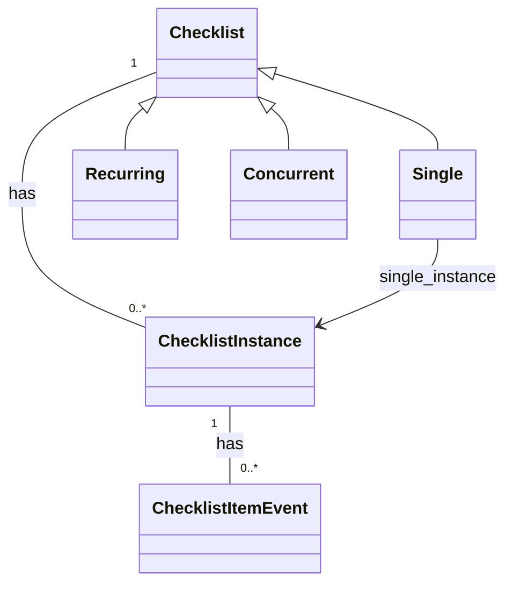

### Checklist Data Model

#### Overview

The checklist data model is the core of the application. It defines the structure of the data that is used to represent checklists and their associated data.

The data model is designed to be flexible and extensible, allowing for a wide range of use cases and scenarios.

The data model consists of several key components:

- Checklists: The main entity that represents a checklist. Each checklist has a title, status, content, and other metadata.
- Checklist Instances: An instance of a checklist that has been assigned to a user or group. Each instance has a set of item states that represent the state of each item in the checklist.
- Checklist Item Events: Events that occur on a checklist item, such as completion or modification.

Checklists in the data model can be organized into libraries, which are collections of checklists that can be shared and reused across workspaces.

Workspaces are the top-level organizational unit in the data model, and contain instances of checklists that have been assigned to users or groups.

#### Data Model



#### Checklist

The `Checklist` class represents a checklist definition, maintaining the content and general layout of each checklist as a [Github-flavoured Markdown](https://github.github.com/gfm/) document. The content for a checklist might look like this:

```
# Checklist Title

- [ ] Item 1
- [ ] Item 2
- [ ] Item 3
```

Here is one place where the data model deviates from a pure relational model. The content of a checklist is stored as a text field in the database, rather than being broken out into separate tables. It is handled this way because the content is the _source of truth_ for a checklist, and it is always accessed and updated as a whole.

From the checklist content, the application can derive the structure of the checklist, including the number of items, the order of the items, and the content of each item. This structure is used to create instances of the checklist, which are assigned to users or groups.

Using a text field to define structural data like this may raise some eyebrows, but even if we parse the content into a more structured format, we still need to store the original content for display and editing purposes. We would also have to continually re-sync a derived, structured model from the text-based content on an ongoing basis.

Each Checklist can be of one of three types: `Single`, `Recurring`, or `Concurrent`.

#### Single

A `Single` checklist is a one-time checklist that is assigned to a user or group. Once the checklist is completed, it is marked as finished and cannot be completed again.

A `Single` checklist is the simplest type of checklist, and is used for tasks that need to be completed once and then forgotten.

#### Recurring

A `Recurring` checklist is a checklist that is assigned to a user or group on a regular basis. Once the checklist is completed, it is reset and can be completed again.

A `Recurring` checklist is useful for tasks that need to be completed on a regular basis, such as daily or weekly chores.

#### Concurrent

A `Concurrent` checklist is a checklist that has multiple open instances at the same time. These instances will often be assigned to individual contexts, such as projects or activities, and can be completed independently of each other. The completion of one instance does not affect the completion of other instances, though progress on each instance may be tracked against the progress of all others in the same checklist.

A `Concurrent` checklist is useful for tasks that need to be completed in parallel, or for tasks that are part of a larger project or set of activities.

### Checklist Instance

The `ChecklistInstance` class represents an instance of a checklist that has been assigned to a user or group. Each instance has a set of item states that represent the state of each item in the checklist.

Internally, the class maintains state as a JSONB array field in the database, which allows for flexible storage of item states without the need for a separate table. Each element in the array corresponds to an item in the checklist, and contains the state of that item. The index of the element in the array corresponds to the index of the item in the checklist content.

The content of the item states array might look like this:

```json

[
    {
        "state": "unchecked"
    },
    {
        "state": "checked"
    },
    {
        "state": "unchecked"
    }
]

```

where the position of each item in the array corresponds to the position of the item in the checklist content.

Again, this approach deviates from a pure relational model, but it is used to maintain the flexibility and extensibility of the data model.

Checklist instance states are only a convenience representation. The actual source of truth for the state of a checklist item is the `ChecklistItemEvent` class, which records events that occur on each item in the checklist.

### Checklist Item Event

The `ChecklistItemEvent` class represents an event that occurs on a checklist item, such as checking or unchecking an item. Each event is associated with a checklist instance, and contains the state of the item at the time the event occurred.

Currently, we only store checked / unchecked events, but this class will be extended to include other types of events in the future. For instance, we anticipate having to record non-boolean states beyond just checked / unchecked (e.g. 'not applicable') in line with user data needs.

We can easily reconstruct the state of a checklist item at any point in time by replaying the events that have occurred on that item. This allows us to maintain a complete history of the state of each item in the checklist, and to track changes to the checklist over time.

`ChecklistItemEvent` records are triggered within the context of a `Workspace`, a container for Obsekio operational data.

### Workspaces

The `Workspace` class represents a container for operational data in Obsekio. Each workspace contains a set of checklists that have been assigned to users or groups, and maintains the state of those checklists over time.

Each user has access to a personal workspace, which contains checklists that have been assigned to that user. Users can also access shared workspaces that are available to members of the same team.

### Libraries

The `Library` class represents a collection of checklists that can be shared and reused across workspaces. Libraries are used to organize checklists into logical groups, and to make it easier to manage and maintain checklists across the application.

Each user has access to a personal library, not shared with other users, and can also access shared libraries that are available to all users in the system. Teams may also have their own libraries, which are only shared among team members.
