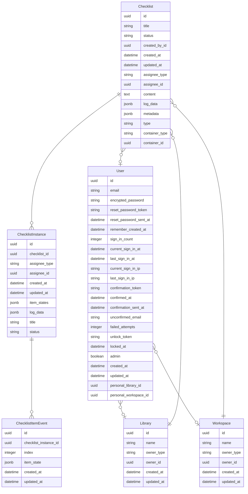

### ER Diagram

```mermaid

erDiagram

    %% table name: checklists
    Checklist {
        uuid id
        string title
        string status
        uuid created_by_id
        datetime created_at
        datetime updated_at
        string assignee_type
        uuid assignee_id
        text content
        jsonb log_data
        jsonb metadata
        string type
        string container_type
        uuid container_id
    }

    %% table name: checklist_instances
    ChecklistInstance {
        uuid id
        uuid checklist_id
        string assignee_type
        uuid assignee_id
        datetime created_at
        datetime updated_at
        jsonb item_states
        jsonb log_data
        string title
        string status
    }

    %% table name: checklist_item_events
    ChecklistItemEvent {
        uuid id
        uuid checklist_instance_id
        integer index
        jsonb item_state
        datetime created_at
        datetime updated_at
    }

    %% table name: libraries
    Library {
        uuid id
        string name
        string owner_type
        uuid owner_id
        datetime created_at
        datetime updated_at
    }

    %% table name: users
    User {
        uuid id
        string email
        string encrypted_password
        string reset_password_token
        datetime reset_password_sent_at
        datetime remember_created_at
        integer sign_in_count
        datetime current_sign_in_at
        datetime last_sign_in_at
        string current_sign_in_ip
        string last_sign_in_ip
        string confirmation_token
        datetime confirmed_at
        datetime confirmation_sent_at
        string unconfirmed_email
        integer failed_attempts
        string unlock_token
        datetime locked_at
        boolean admin
        datetime created_at
        datetime updated_at
        uuid personal_library_id
        uuid personal_workspace_id
    }

    %% table name: workspaces
    Workspace {
        uuid id
        string name
        string owner_type
        uuid owner_id
        datetime created_at
        datetime updated_at
    }

    Checklist ||--o{ ChecklistInstance : ""
    Checklist }o--o| User : ""
    ChecklistInstance ||--o{ ChecklistItemEvent : ""
    Library ||--o{ Checklist : ""
    User }o--o| Library : ""
    User }o--o| Workspace : ""
    Workspace ||--o{ Checklist : ""

```

