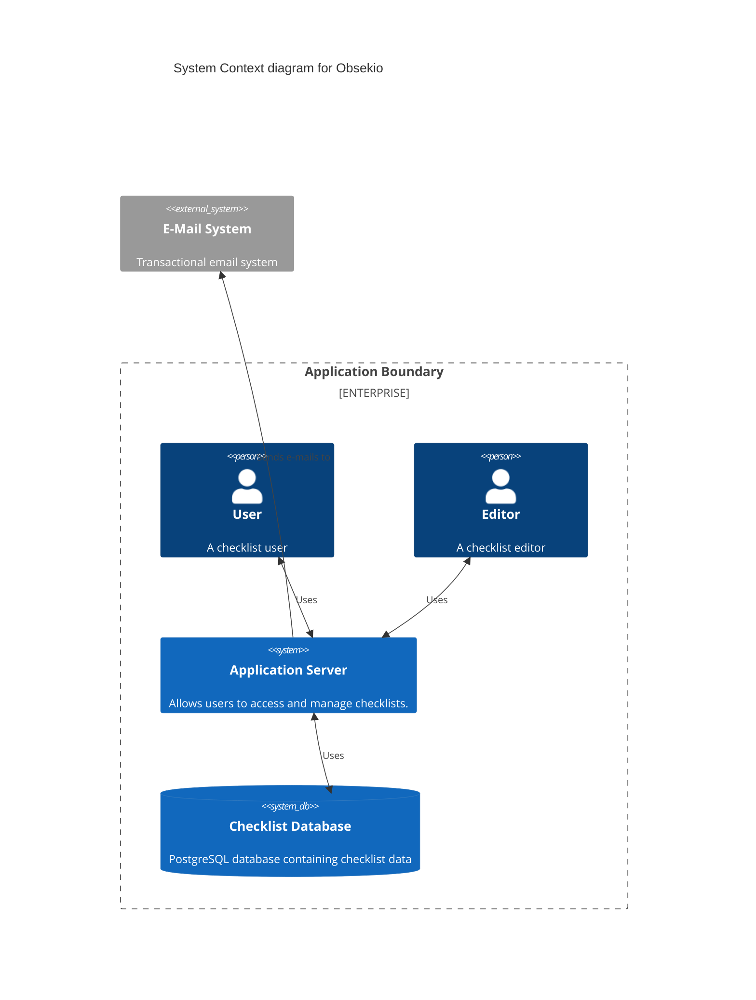

### System Context

```mermaid
  C4Context
    title System Context diagram for Obsekio

    System_Ext(email_system, "E-Mail System", "Transactional email system")

    Enterprise_Boundary(b0, "Application Boundary") {

      Person(UserA, "User", "A checklist user")
      Person(UserB, "Editor", "A checklist editor")

      System(SystemA, "Application Server", "Allows users to access and manage checklists.")

      SystemDb(SystemB, "Checklist Database", "PostgreSQL database containing checklist data")

      BiRel(UserA, SystemA, "Uses")
      BiRel(UserB, SystemA, "Uses")
      BiRel(SystemA, SystemB, "Uses")

      Rel(SystemA, email_system, "Sends e-mails to")
    }

```

